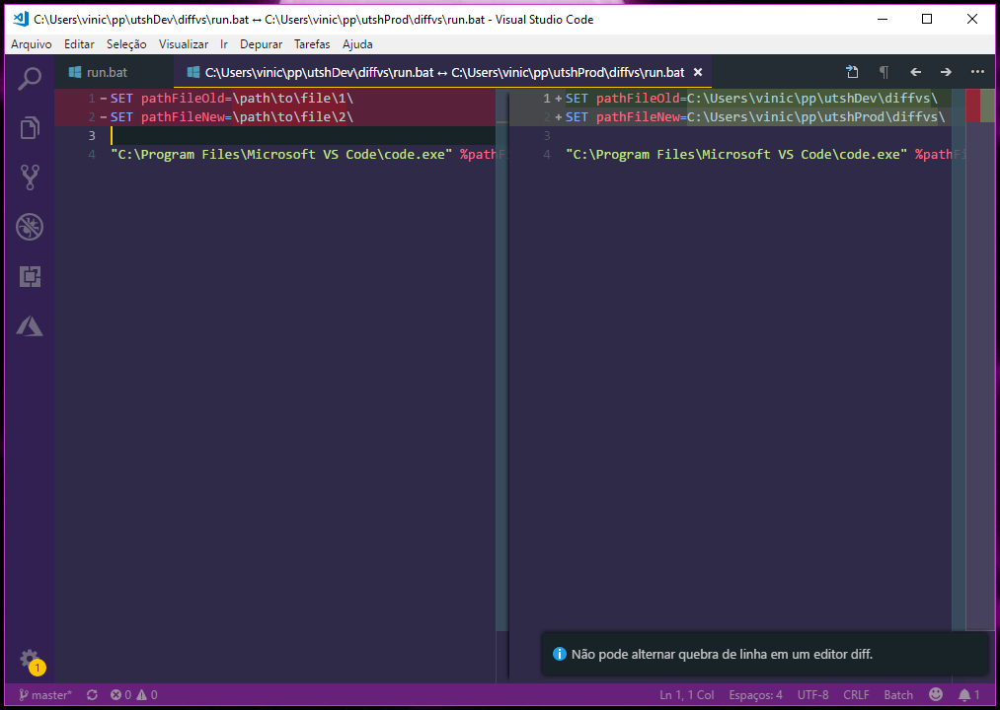

# diffvs
Compare, like Meld, files in Visual Studio Code

When you repeatedly compare files that are in different folders, for example:

`/home/vinicius/repo1/index.js` with `/home/vinicius/repo2/index.js`



## Run in Linux
Use [run](https://github.com/viniceosm/utsh/blob/master/diffvs/run), change the paths in file

```console
~/utssh/diffvs$ ./run path/file.js
```


## Run in Windows
Use [run.bat](https://github.com/viniceosm/utsh/blob/master/diffvs/run.bat), change the paths in file
```console
utssh\diffvs>run path/file.js
```
